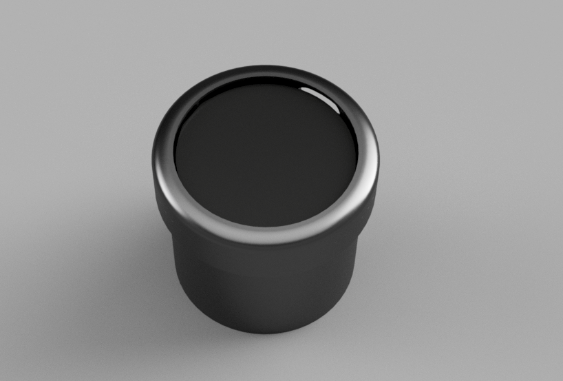

# Open-Gauge 🏎️

**An Open Source 52mm CAN Bus Gauge**

Open-Gauge is an open-source hardware and software project designed to create a modern, high-performance digital gauge for automotive applications. It fits into a standard **52mm (2 1/16")** gauge pod. Currently utilises the ESP32-S3 to render smooth, high-resolution graphics while interfacing directly with vehicle CAN bus networks.

## Purpose
My Goal with this project is to create a better alternitive to all of the closed source gauges esp-32 based and others from large brands. I initally chose the Lillygo display as it fit the requirements of having a large vibrant AMOLED display and extra io pins broken out on the back of the board. 
### V1 will be built upon the LilyGo Hardware with a Sheild/Hat board that plugs into the T-Dsiplay to give robust voltage regulation, a 2 wire canbus tranceiver and a 4 pin jst connect for the reqired connections (+12v, GND, CANH, CANL). 
### My gold with V2 of the gauge is to design custom hardware utilising a STM32u5, instead of the esp32 for vastly greater graphical performance.
## 🚀 Initial Development status

We currently have a functional prototype running on the **LilyGO T-Display S3 AMOLED (1.75")**. The core firmware and hardware are established.

### Hardware Prototype

* **MCU:** ESP32-S3 (Dual-core, 240MHz, WiFi/BLE).

* **Display:** 1.75" AMOLED (466x466 resolution) via QSPI.

* **Interface:** Custom Carrier Board designed for automotive environments.

  * **Power:** 6V-36V Input (Load Dump protected) -> 5V Buck -> 3.3V LDO.

  * **Comms:** High-Speed CAN FD Transceiver (TJA1051T/3) on IO38/39.

### Software Stack

* **Framework:** ESP-IDF v5.x (FreeRTOS).

* **Graphics:** LVGL 9.x optimized for SPI/DMA (achieving 30-60 FPS).

* **Features Implemented:**

  * **Double Buffered Rendering:** Uses PSRAM for tear-free, high-speed drawing.

  * **Dynamic Styling:** Touch-to-cycle between 9 distinct gauge themes (Standard, Sci-Fi, Heatmap, Retro Needle, etc.).

  * **Hardware Abstraction:** Custom drivers for the CO5300/SH8601 display controller and CST9217 touch panel.

## 🎯 Long Term Goals

The vision for Open-Gauge extends beyond a simple display. We aim to build a fully customizable platform for car enthusiasts.

1. **Custom PCB Design:** Move from the dev-board to a custom round PCB that mounts directly behind the AMOLED screen to fit inside standard gauge cups.

2. **OBD-II & CAN Decoding:** Implement a flexible library to decode standard OBD-II PIDs (RPM, Coolant, Boost) and raw CAN frames for aftermarket ECUs (Link, Haltech, MoTeC).

3. **Wireless Configurator:** Utilise the ESP32's WiFi to host a web server, allowing users to change colours, sensor mappings, and alarms from their phone without recompiling code.

4. **Daisy Chaining:** Support for linking multiple gauges together to share power and data.

## 🛠️ Getting Started

### Prerequisites

* **ESP-IDF v5.x** installed and configured.

* **[LilyGO T-Display S3 AMOLED](https://lilygo.cc/products/t-display-s3-amoled-1-64?variant=44848332931253)** (1.75" Version).

* **TJA1051T/3** CAN Transceiver module (or custom PCB).

### Wiring (Prototype)

| Signal | ESP32 Pin | Function | 
 | ----- | ----- | ----- | 
| **CAN TX** | GPIO 38 | Transmit to CAN Bus | 
| **CAN RX** | GPIO 39 | Receive from CAN Bus | 
| **Power** | 5V / GND | Regulated input | 
